# Creating your first blog


In the age old tradition of starting a blog, i thought that i would make my first post all about... *starting a blog*! I made this blog using GitHub pages, which is a super easy and intuitive static web hosting service provided by GitHub that can all be written in Markdown (perhaps the easiest programming language in existence), using [Jekyll](https://jekyllrb.com/) as a backend to handle all of the more complex web hosting stuff. I thought that i would make this post as accessible and easy to follow as possible, and assume no former programming knowledge. Hopefully someone will find this helpful in getting their own blog started as well! This post is just a superficial first steps to get you *off the ground* with GitHub pages, but the [GitHub pages](https://pages.github.com/) documentation are a really useful resource!


## Setting up GitHub pages

First thing to do is to head over to [GitHub](https://github.com/) and create a new repository

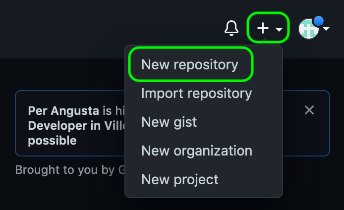

* Give your new repository a useful name, i.e. ```make-a-blog```, and a quick description
* Make sure you set the repository to Public - GitHub only hosts webpages for public repositories on the free account
* It's always nice to initialise your repository with a README
* Once you're ready - hit Create repository

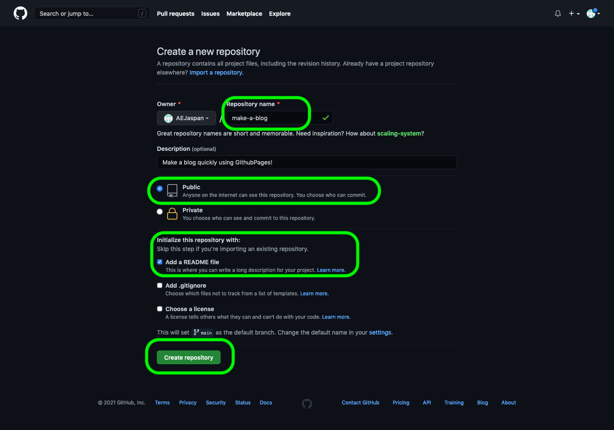

Now you have a blank repository to build your blog in!

If you go to Settings, and scroll down to the GitHub pages section, you can choose a theme. There are several great themes available to choose from!

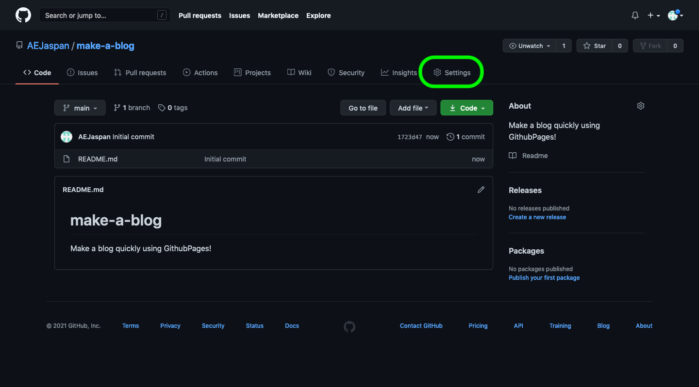

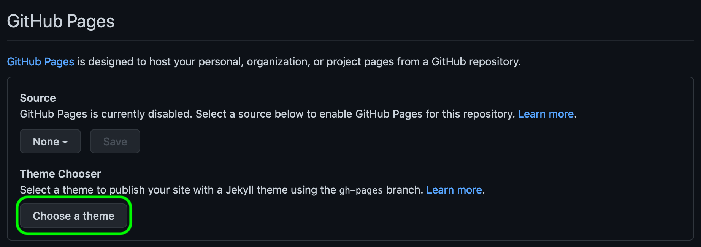


Here, i've chosen the Cayman theme. Once you've chosen one you like, hit 'select theme', which will take you to a commit, which contains the index of your first landing page. Hit 'Commit Changes' to upload this file to your repository. These changes will then be pushed to a new branch called ```gh-pages```.

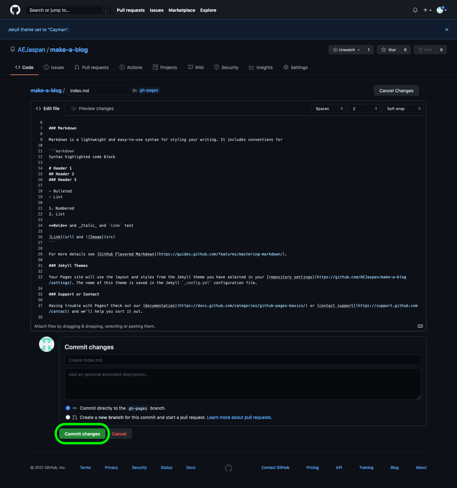

This will take you back to your original repository. To find the branch that contains the changes that you just pushed, you just switch branches by hitting the branch drop down menu and selecting ```gh-pages```. You will then see that GitHub has created the files ```index.md``` and ```_config.yml```, which are used to steer your new webpage.

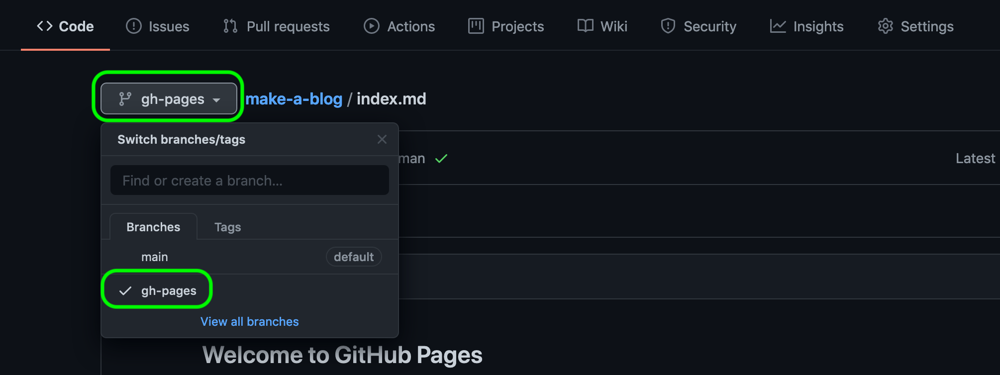

If you switch back over to the 'Settings' tab, and scroll down to GitHub pages, you will see that you're site is now published on the web at the address ```http(s)://user_name.github.io/repo_name/``` where ```user_name``` and ```repo_name``` are your account username and the name of the repository that you just created. You can also choose to change the domain name here, under `Custom domain`. This will change the ```user_name.github.io``` part of your web address.

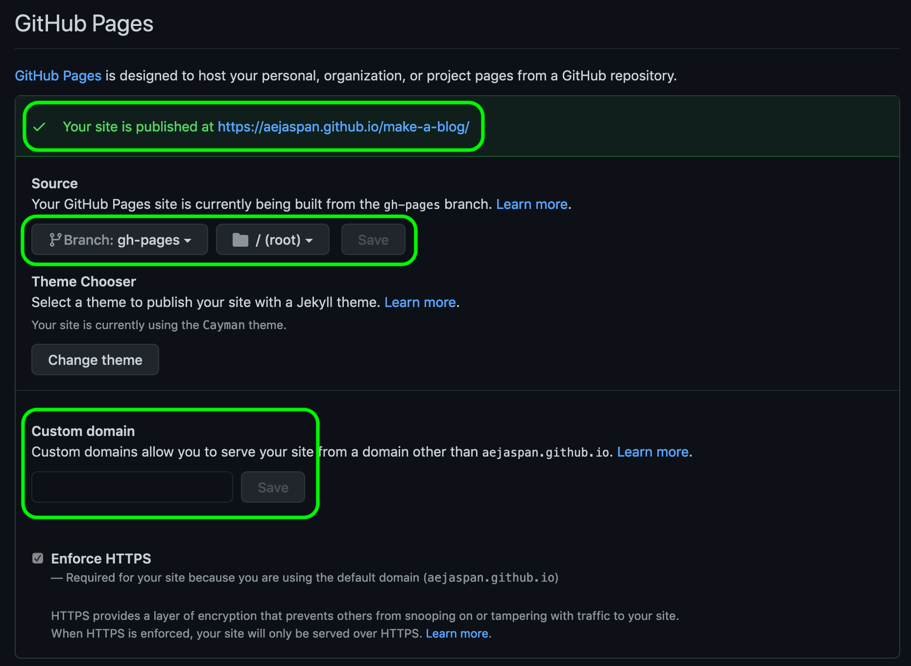

If you go to the web address shown, then you should see a page like the one below!

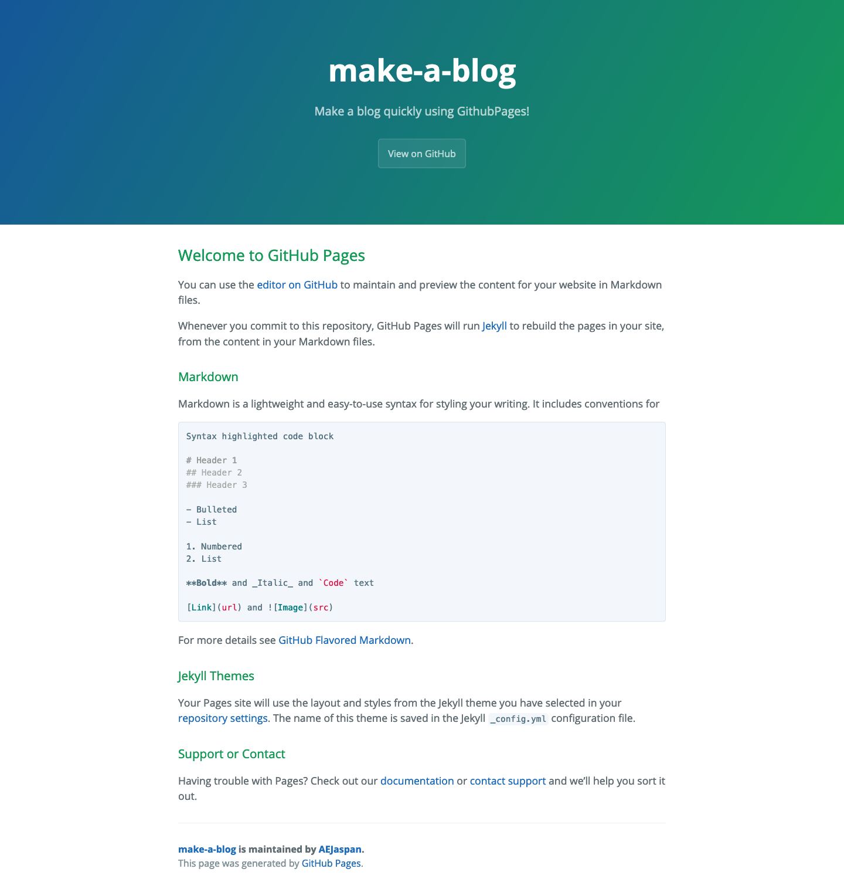

Congratulations, you've just set up your first web page! From here, you can write changes directly into GitHub's IDE (Interactive Developer Environment) to add content to your webpage using Markdown. Alternatively, you can clone your repository and make your changes locally.


## Writing your Blog

### Downloading Git

The GitHub IDE is great, but sometimes it's much easier to write locally on your own computer, in your own preferred text editor. To do this, you will need to install Git on your computer. You can check to see if you already have it installed by running:

```bash
[12:13] my-blog $  : git --version
```

It's already installed on my computer, so this command will print out the version number of my Git version.

```text
git version 2.28.0
```

If this isn't printed for you, then you can follow the steps shown [here](https://git-scm.com/book/en/v2/Getting-Started-Installing-Git)


### Cloning your repository

You can then clone the repository by copying the link shown and using the command ```git clone <repo_url>```

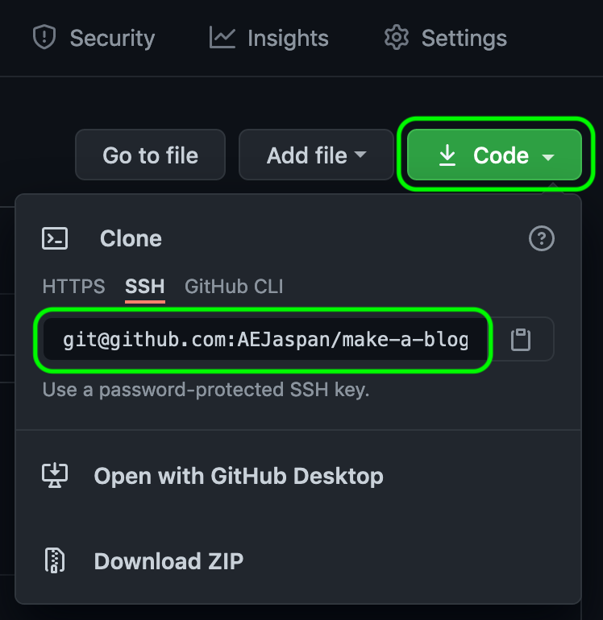

```bash
[12:13] Blog $  : git clone git@github.com:AEJaspan/make-a-blog.git
```
```text
Cloning into 'make-a-blog'...
remote: Enumerating objects: 8, done.
remote: Counting objects: 100% (8/8), done.
remote: Compressing objects: 100% (6/6), done.
remote: Total 8 (delta 1), reused 0 (delta 0), pack-reused 0
Receiving objects: 100% (8/8), done.
Resolving deltas: 100% (1/1), done.
```

Now, switch into your new local repository clone, and take a look at the branch structure.

```bash
[12:13] Blog $  : cd make-a-blog/
[12:13] make-a-blog $  : git branch -a
```

```text
* main
  remotes/origin/HEAD -> origin/main
  remotes/origin/gh-pages
  remotes/origin/main
```

You see that the ```gh-pages``` branch is on the remote. If you now check out this branch, you will find the ```index.md``` and ```_config.yml``` files that we saw earlier.

```bash
[12:13] make-a-blog $  : git checkout remotes/origin/gh-pages
```

Once you've checked out this branch, you will be put into the ```'detached HEAD'``` state. You can learn more about this in the [Git docs](https://git-scm.com/docs/git-checkout#_detached_head).

```text
Note: switching to 'remotes/origin/gh-pages'.

You are in 'detached HEAD' state. You can look around, make experimental
changes and commit them, and you can discard any commits you make in this
state without impacting any branches by switching back to a branch.

If you want to create a new branch to retain commits you create, you may
do so (now or later) by using -c with the switch command. Example:

  git switch -c <new-branch-name>

Or undo this operation with:

  git switch -

Turn off this advice by setting config variable advice.detachedHead to false

HEAD is now at 61a3cbe Create index.md
```

We can now switch to the ```gh-pages``` branch directly:

```bash
[12:14] make-a-blog $  : git switch gh-pages
```

```text
Branch 'gh-pages' set up to track remote branch 'gh-pages' from 'origin'.
Switched to a new branch 'gh-pages'
```

If you look at the list of branches now:

```bash
[12:14] make-a-blog $  : git branch -a
```

We see that the ```gh-pages``` branch is now a local branch.

```text
* gh-pages
  main

  remotes/origin/HEAD -> origin/main
  remotes/origin/gh-pages
  remotes/origin/main
```

We can now make changes to this, and return to our ```main``` branch using ```git switch main```.

### Structuring your blog blog posts

So great, you've got a working website, and you can easily add your text to it. It is a little messy, however to have everything on one page. To fix this, you can structure your blog posts in sub-directories. The following commands will do just this, and then push these changes directly to your webpage:

```bash
[12:24] make-a-blog $  : mkdir -p BlogPosts/Post001
[12:25] make-a-blog $  : echo '# My first blog post!' > BlogPosts/Post001/index.md
[12:26] make-a-blog $  : echo '[link to post](BlogPosts/Post001/index.md)' > index.md
[12:27] make-a-blog $  : git add index.md
[12:27] make-a-blog $  : git add BlogPosts/
[12:27] make-a-blog $  : git commit -m 'Creating my first blog post!'
```

```text
[gh-pages 9809b7d] Creating my first blog post!
 2 files changed, 2 insertions(+), 37 deletions(-)
 create mode 100644 BlogPosts/Post001/index.md
 rewrite index.md (100%)
```

```bash
[12:27] make-a-blog $  : git push
```

```text
Enumerating objects: 8, done.
Counting objects: 100% (8/8), done.
Delta compression using up to 4 threads
Compressing objects: 100% (2/2), done.
Writing objects: 100% (6/6), 494 bytes | 494.00 KiB/s, done.
Total 6 (delta 0), reused 0 (delta 0), pack-reused 0
To github.com:AEJaspan/make-a-blog.git
   61a3cbe..9809b7d  gh-pages -> gh-pages
```

Congratulations, you've just started your first blog post! You page should now look something like this:


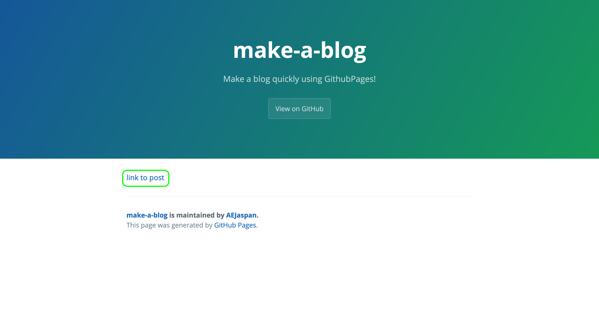

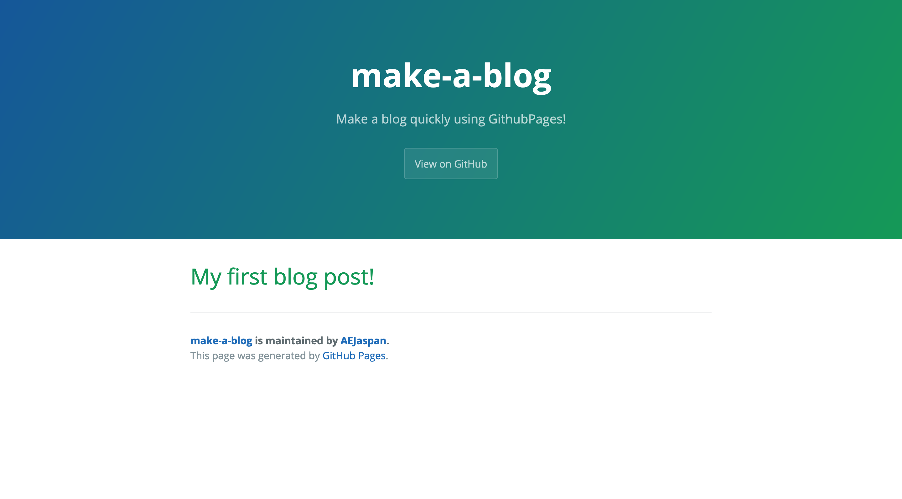
